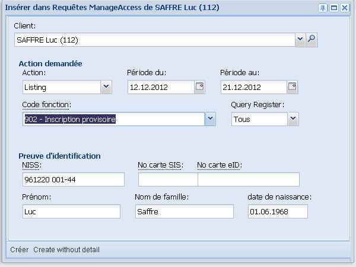
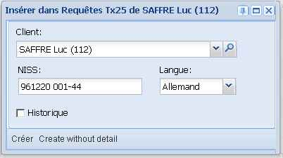
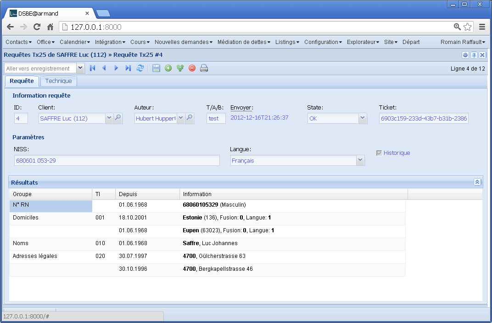

Lancer des requêtes BCSS
========================

Lino permet pour l'instant trois types de requêtes vers 
la Banque Barrefour de la Sécurité Sociale:
IdentifyPerson_ , ManageAccess_  et RetrieveTIGroups_.

IdentifyPerson
--------------

Le service `IdentifyPerson` permet d'dentifier une personne par son NISS 
ou ses données phonétiques et vérifier son identité par le numéro de carte SIS, 
de carte d'identité ou par ses données phonétiques.

.. image:: a.jpg
  :scale: 100

.. image:: b.jpg
  :scale: 60

ManageAccess
--------------

Le service `ManageAccess` permet d'enregistrer, de désenregistrer ou de consulter 
un dossier dans le registre du réseau de la sécurité sociale (registre BCSS)
et dans le répertoire sectoriel des CPAS géré par la SmalS-MvM.

  
RetrieveTIGroups
----------------

Le service `RetrieveTIGroups`
(également connu comme "Tx 25")
permet dbtenir des informations à propos d’une personne dans 
le cadre de l’enquête sociale.
  

.. image:: g.jpg
  :scale: 60

Vue technique
-------------

.. image:: c.jpg
  :scale: 60

