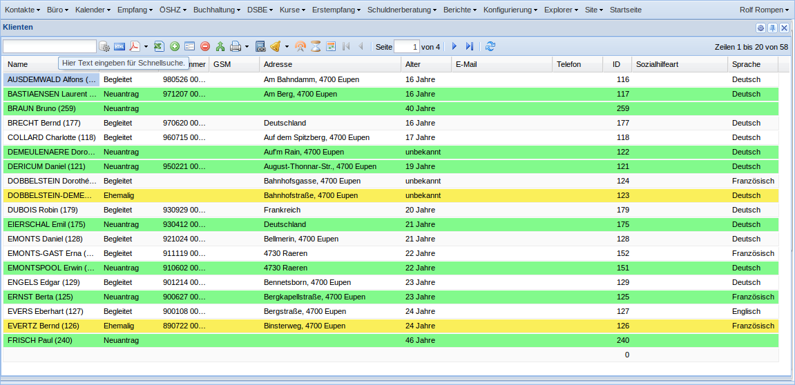
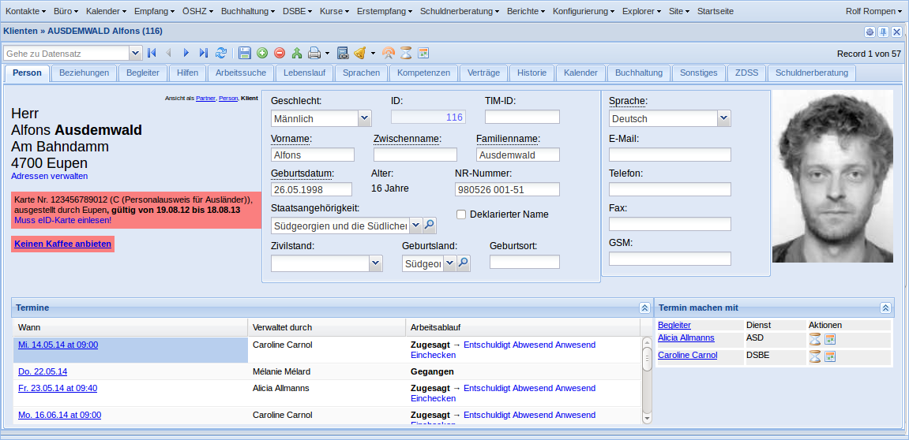

.. _welfare.de.screenshots:

==========
Bildertour
==========

Die Online-Demo von Lino Welfare befindet sich unter
http://welfare-demo.lino-framework.org

Dort können Sie die folgenden Bildschirmansichten auch selber
nachspielen.

-----------------
Vor der Anmeldung
-----------------

Solange Sie sich nicht angemeldet haben, sind sie ein anonymer
Benutzer.  Da es sich um eine Demo-Datenbank handelt, stehen hier
alle Benutzer sowie deren Passwörter gezeigt.  Beachten Sie, dass
*Sprache* und *Benutzerprofil* variieren.
(siehe :mod:`lino_welfare.modlib.welfare.roles`)

.. image:: login1.png
    :alt: Vor der Anmeldung

------------------
Das Anmeldefenster
------------------

Wir melden uns an mit Benutzernamen "rolf" und Passwort "1234".

.. image:: login2.png
    :alt: Das Anmeldefenster

------------------
Nach der Anmeldung
------------------

Das ist der Startbildschirm. Hier haben wir eine Serie von Elementen:

- Das Hauptmenü
- Quicklinks
- Begrüßungsmeldungen
- Diverse Tabellen

.. image:: welcome.png
    :alt: Nach der Anmeldung

----------------------------------
Das Menü :menuselection:`Kontakte`
----------------------------------

.. image:: menu_kontakte.png
    :alt: Das Menü :menuselection:`Kontakte`

------------------
Liste der Klienten
------------------

Wählen Sie :menuselection:`Kontakte --> Klienten`, um die Liste
aller Klienten zu zeigen.

-------------
Detail Klient
-------------

Doppelklick auf eine Zeile, um das Detail dieses Klienten zu zeigen.

