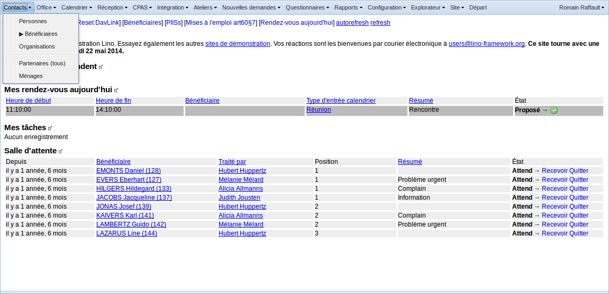
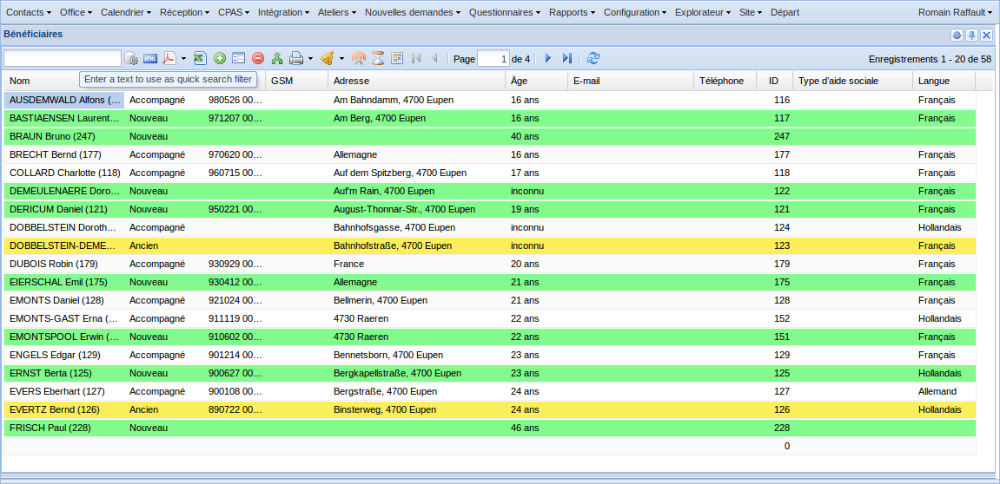
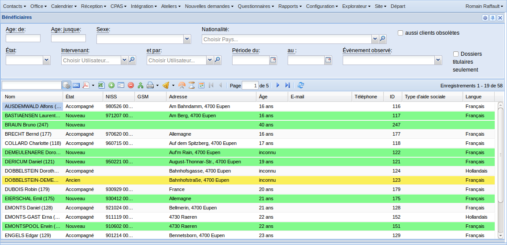
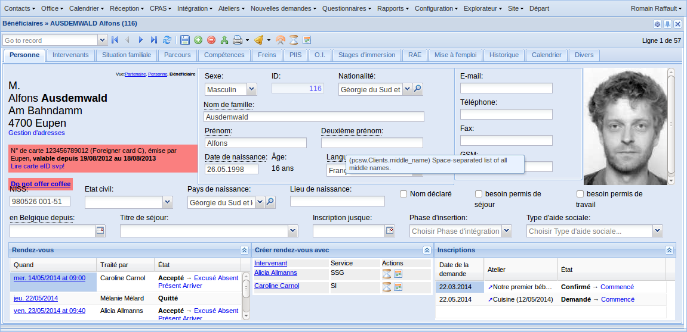

.. _welfare.fr.tour:

============
Tour de Lino
============

Voici un petit tour dans Lino Welfare.

Vous pouvez également aller jouer vous-même sur notre `site de
démonstraton en ligne <http://welfare-demo.lino-framework.org>`_

----------------------
Avant l'identification
----------------------

Tant que vous êtes anonyme, Lino parlera la langue préférée configurée de
votre navigateur.
Choisissez un des nom d'utilisateur pour vous connecter.
Notez que la langue et les droits d'accès dépendront de votre choix.
Voir également :doc:`/users`.

.. image:: login1.png
    :alt: Avant l'identification
    :width: 500

------------
S'identifier
------------

Nous nous connectons avec le nom de "romain" et mot de passe "1234".

.. image:: login2.png
    :alt: S'identifier
    :width: 500

-----------------
L'écran d'accueil
-----------------

Nous voici dans l'écran d'accueil. Il contient une série d'éléments:

- Le menu principal
- Les raccourcis ("quick links")
- Les messages d'accueil
- Un certain nombre de tableaux avec des informations diverses

.. image:: welcome.png
    :alt: L'écran d'accueil
    :width: 500

---------------------------------
Le menu :menuselection:`Contacts`
---------------------------------

Dans Lino Welfare, les "contacts" sont toutes les personnes et
organisations extérieures.

--------------------------
La liste des bénéficiaires
--------------------------

Sélectionnez :menuselection:`Contacts --> Bénéficiaires` pour
ouvrir la liste générale des bénéficiaires.

-----------------------
Le panneau à paramètres
-----------------------

    

---------------------------
Le détail d'un bénéficiaire
---------------------------

Doppelklick auf eine Zeile, um das Detail dieses Klienten zu zeigen.

