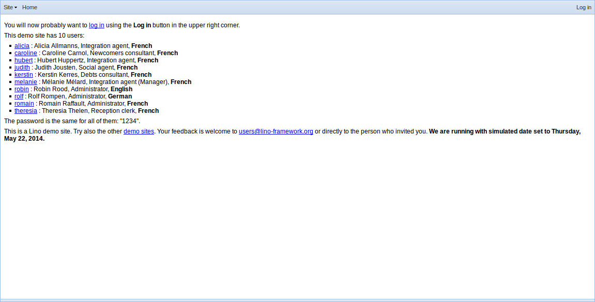
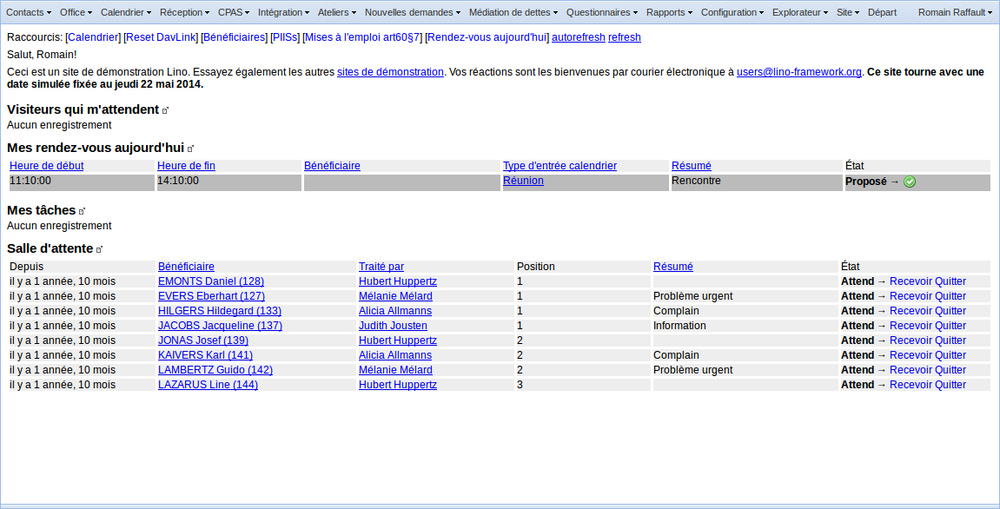
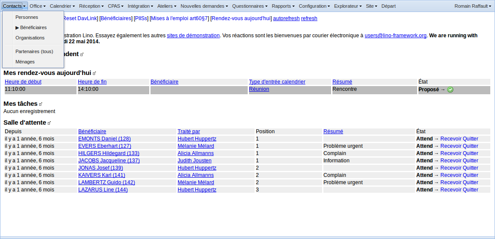

.. _welfare.fr.screenshots:

==============
Images d'écran
==============

Die Online-Demo von Lino Welfare befindet sich unter
http://welfare-demo.lino-framework.org

Dort können Sie die folgenden Bildschirmansichten auch selber
nachspielen.

----------------------
Avant l'identification
----------------------

Solange Sie sich nicht angemeldet haben, sind Sie ein anonymer
Benutzer.  Da es sich um eine Demo-Datenbank handelt, stehen hier
alle Benutzer sowie deren Passwörter gezeigt, damit Sie die
Unterschiede ausprobieren können.  Beachten Sie, dass *Sprache*
und *Benutzerprofil* variieren.  (Siehe
:mod:`lino_welfare.modlib.welfare.roles`)

------------
S'identifier
------------

Nous nous connectons avec le nom de "romain" et mot de passe "1234".

.. image:: login2.png
    :alt: S'identifier

----------------------
Après l'identification
----------------------

Nous voici dans l'écran d'accueil. Il consiste d'une série d'éléments:

- Le menu principal
- Les raccourcis ("quick links")
- Les messages d'accueil
- Un certain nombre de tables

---------------------------------
Le menu :menuselection:`Contacts`
---------------------------------

--------------------------
La liste des bénéficiaires
--------------------------

Wählen Sie :menuselection:`Kontakte --> Klienten`, um die Liste
aller Klienten zu zeigen.

.. image:: contacts.Clients.grid.png
    :alt: La liste des bénéficiaires

---------------------------
Le détail d'un bénéficiaire
---------------------------

Doppelklick auf eine Zeile, um das Detail dieses Klienten zu zeigen.

.. image:: contacts.Clients.detail.png
    :alt: Le détail d'un bénéficiaire

